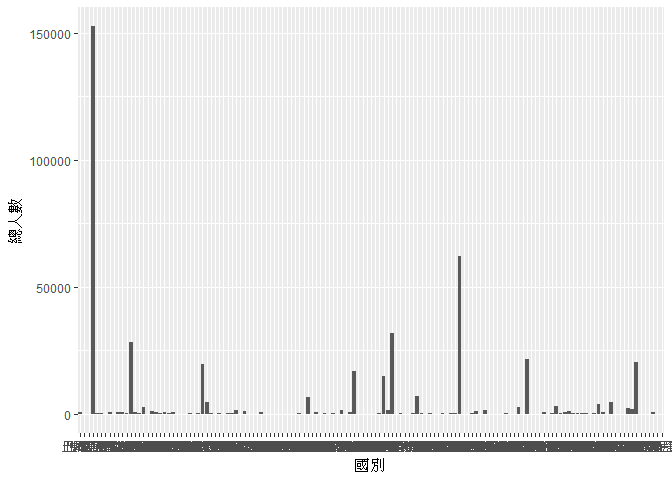
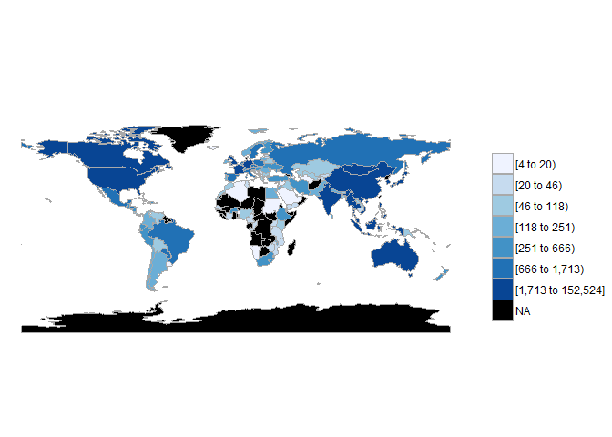
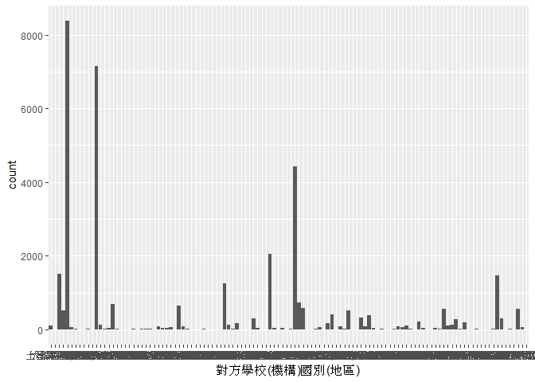
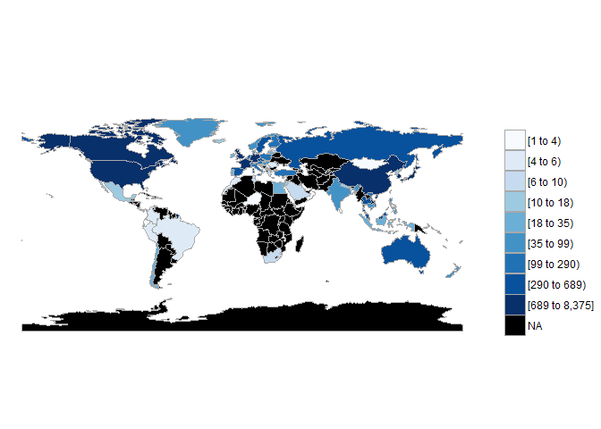
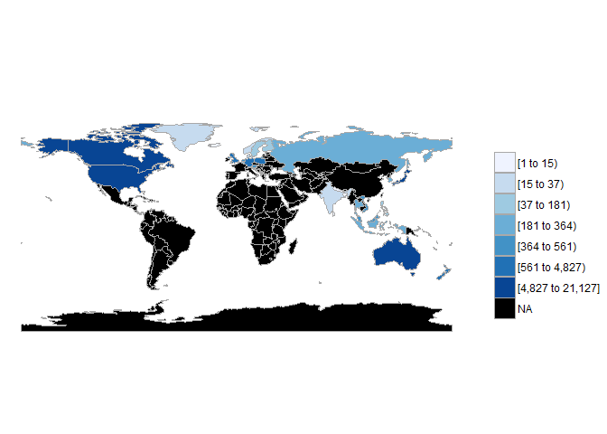

106-2 大數據分析方法 作業二
================
林伯鴻

作業完整說明[連結](https://docs.google.com/document/d/1aLGSsGXhgOVgwzSg9JdaNz2qGPQJSoupDAQownkGf_I/edit?usp=sharing)

學習再也不限定在自己出生的國家，台灣每年有許多學生選擇就讀國外的大專院校，同時也有人多國外的學生來台灣就讀，透過分析[大專校院境外學生人數統計](https://data.gov.tw/dataset/6289)、[大專校院本國學生出國進修交流數](https://data.gov.tw/dataset/24730)、[世界各主要國家之我國留學生人數統計表](https://ws.moe.edu.tw/Download.ashx?u=C099358C81D4876CC7586B178A6BD6D5062C39FB76BDE7EC7685C1A3C0846BCDD2B4F4C2FE907C3E7E96F97D24487065577A728C59D4D9A4ECDFF432EA5A114C8B01E4AFECC637696DE4DAECA03BB417&n=4E402A02CE6F0B6C1B3C7E89FDA1FAD0B5DDFA6F3DA74E2DA06AE927F09433CFBC07A1910C169A1845D8EB78BD7D60D7414F74617F2A6B71DC86D17C9DA3781394EF5794EEA7363C&icon=..csv)可以了解103年以後各大專院校國際交流的情形。請同學分析以下議題，並以視覺化的方式呈現分析結果，呈現103年以後大專院校國際交流的情形。

來台境外生分析
--------------

### 資料匯入與處理

``` r
library(readr)
```

    ## Warning: package 'readr' was built under R version 3.4.4

``` r
library(dplyr)
```

    ## Warning: package 'dplyr' was built under R version 3.4.4

    ## 
    ## Attaching package: 'dplyr'

    ## The following objects are masked from 'package:stats':
    ## 
    ##     filter, lag

    ## The following objects are masked from 'package:base':
    ## 
    ##     intersect, setdiff, setequal, union

``` r
library(knitr)
```

    ## Warning: package 'knitr' was built under R version 3.4.4

``` r
library(ggplot2)
```

    ## Warning: package 'ggplot2' was built under R version 3.4.4

``` r
library(choroplethr)
```

    ## Warning: package 'choroplethr' was built under R version 3.4.4

    ## Loading required package: acs

    ## Warning: package 'acs' was built under R version 3.4.4

    ## Loading required package: stringr

    ## Loading required package: XML

    ## 
    ## Attaching package: 'acs'

    ## The following object is masked from 'package:dplyr':
    ## 
    ##     combine

    ## The following object is masked from 'package:base':
    ## 
    ##     apply

``` r
library(choroplethrMaps)
```

    ## Warning: package 'choroplethrMaps' was built under R version 3.4.4

``` r
c103<-read_csv("http://stats.moe.gov.tw/files/detail/103/103_ab103_C.csv")
```

    ## Parsed with column specification:
    ## cols(
    ##   洲別 = col_character(),
    ##   國別 = col_character(),
    ##   `學位生-正式修讀學位外國生` = col_integer(),
    ##   `學位生-僑生(含港澳)` = col_integer(),
    ##   `學位生-正式修讀學位陸生` = col_integer(),
    ##   `非學位生-外國交換生` = col_integer(),
    ##   `非學位生-外國短期研習及個人選讀` = col_integer(),
    ##   `非學位生-大專附設華語文中心學生` = col_integer(),
    ##   `非學位生-大陸研修生` = col_integer(),
    ##   `非學位生-海青班` = col_integer(),
    ##   境外專班 = col_integer()
    ## )

``` r
c104<-read_csv("http://stats.moe.gov.tw/files/detail/104/104_ab104_C.csv")
```

    ## Parsed with column specification:
    ## cols(
    ##   洲別 = col_character(),
    ##   國別 = col_character(),
    ##   `學位生-正式修讀學位外國生` = col_integer(),
    ##   `學位生-僑生(含港澳)` = col_integer(),
    ##   `學位生-正式修讀學位陸生` = col_integer(),
    ##   `非學位生-外國交換生` = col_integer(),
    ##   `非學位生-外國短期研習及個人選讀` = col_integer(),
    ##   `非學位生-大專附設華語文中心學生` = col_integer(),
    ##   `非學位生-大陸研修生` = col_integer(),
    ##   `非學位生-海青班` = col_integer(),
    ##   境外專班 = col_integer()
    ## )

``` r
c105<-read_csv("http://stats.moe.gov.tw/files/detail/105/105_ab105_C.csv")
```

    ## Parsed with column specification:
    ## cols(
    ##   洲別 = col_character(),
    ##   國別 = col_character(),
    ##   學位生_正式修讀學位外國生 = col_integer(),
    ##   `學位生_僑生(含港澳)` = col_integer(),
    ##   學位生_正式修讀學位陸生 = col_integer(),
    ##   非學位生_外國交換生 = col_integer(),
    ##   非學位生_外國短期研習及個人選讀 = col_integer(),
    ##   非學位生_大專附設華語文中心學生 = col_integer(),
    ##   非學位生_大陸研修生 = col_integer(),
    ##   非學位生_海青班 = col_integer(),
    ##   境外專班 = col_integer()
    ## )

``` r
c106<-read_csv("http://stats.moe.gov.tw/files/detail/106/106_ab105_C.csv")
```

    ## Parsed with column specification:
    ## cols(
    ##   洲別 = col_character(),
    ##   國別 = col_character(),
    ##   學位生_正式修讀學位外國生 = col_integer(),
    ##   `學位生_僑生(含港澳)` = col_integer(),
    ##   學位生_正式修讀學位陸生 = col_integer(),
    ##   非學位生_外國交換生 = col_integer(),
    ##   非學位生_外國短期研習及個人選讀 = col_integer(),
    ##   非學位生_大專附設華語文中心學生 = col_integer(),
    ##   非學位生_大陸研修生 = col_integer(),
    ##   非學位生_海青班 = col_integer(),
    ##   境外專班 = col_integer()
    ## )

``` r
s103<-read_csv("http://stats.moe.gov.tw/files/detail/103/103_ab103_S.csv")
```

    ## Parsed with column specification:
    ## cols(
    ##   學校類型 = col_character(),
    ##   學校代碼 = col_character(),
    ##   學校名稱 = col_character(),
    ##   `學位生-正式修讀學位外國生` = col_integer(),
    ##   `學位生-僑生(含港澳)` = col_integer(),
    ##   `學位生-正式修讀學位陸生` = col_integer(),
    ##   `非學位生-外國交換生` = col_integer(),
    ##   `非學位生-外國短期研習及個人選讀` = col_integer(),
    ##   `非學位生-大專附設華語文中心學生` = col_integer(),
    ##   `非學位生-大陸研修生` = col_character(),
    ##   `非學位生-海青班` = col_integer(),
    ##   境外專班 = col_integer()
    ## )

``` r
s104<-read_csv("http://stats.moe.gov.tw/files/detail/104/104_ab104_S.csv")
```

    ## Parsed with column specification:
    ## cols(
    ##   學校類型 = col_character(),
    ##   學校代碼 = col_character(),
    ##   學校名稱 = col_character(),
    ##   `學位生-正式修讀學位外國生` = col_integer(),
    ##   `學位生-僑生(含港澳)` = col_integer(),
    ##   `學位生-正式修讀學位陸生` = col_integer(),
    ##   `非學位生-外國交換生` = col_integer(),
    ##   `非學位生-外國短期研習及個人選讀` = col_integer(),
    ##   `非學位生-大專附設華語文中心學生` = col_integer(),
    ##   `非學位生-大陸研修生` = col_character(),
    ##   `非學位生-海青班` = col_integer(),
    ##   境外專班 = col_integer()
    ## )

``` r
s105<-read_csv("http://stats.moe.gov.tw/files/detail/105/105_ab105_S.csv")
```

    ## Parsed with column specification:
    ## cols(
    ##   學校類型 = col_character(),
    ##   學校代碼 = col_character(),
    ##   學校名稱 = col_character(),
    ##   學位生_正式修讀學位外國生 = col_integer(),
    ##   `學位生_僑生(含港澳)` = col_integer(),
    ##   學位生_正式修讀學位陸生 = col_integer(),
    ##   非學位生_外國交換生 = col_integer(),
    ##   非學位生_外國短期研習及個人選讀 = col_integer(),
    ##   非學位生_大專附設華語文中心學生 = col_integer(),
    ##   非學位生_大陸研修生 = col_integer(),
    ##   非學位生_海青班 = col_integer(),
    ##   境外專班 = col_integer()
    ## )

``` r
s106<-read_csv("http://stats.moe.gov.tw/files/detail/106/106_ab105_S.csv")
```

    ## Parsed with column specification:
    ## cols(
    ##   學校類型 = col_character(),
    ##   學校代碼 = col_character(),
    ##   學校名稱 = col_character(),
    ##   學位生_正式修讀學位外國生 = col_integer(),
    ##   `學位生_僑生(含港澳)` = col_integer(),
    ##   學位生_正式修讀學位陸生 = col_integer(),
    ##   非學位生_外國交換生 = col_integer(),
    ##   非學位生_外國短期研習及個人選讀 = col_integer(),
    ##   非學位生_大專附設華語文中心學生 = col_integer(),
    ##   非學位生_大陸研修生 = col_integer(),
    ##   非學位生_海青班 = col_integer(),
    ##   境外專班 = col_integer()
    ## )

``` r
odsresult<-read_csv("Student_RPT_07.csv")
```

    ## Parsed with column specification:
    ## cols(
    ##   學年度 = col_integer(),
    ##   學期 = col_integer(),
    ##   設立別 = col_character(),
    ##   學校類別 = col_character(),
    ##   學校代碼 = col_character(),
    ##   學校名稱 = col_character(),
    ##   系所代碼 = col_integer(),
    ##   系所名稱 = col_character(),
    ##   學制 = col_character(),
    ##   `對方學校(機構)國別(地區)` = col_character(),
    ##   `對方學校(機構)中文名稱` = col_character(),
    ##   `對方學校(機構)英文名稱` = col_character(),
    ##   小計 = col_integer(),
    ##   男 = col_integer(),
    ##   女 = col_integer()
    ## )

    ## Warning: 2 parsing failures.
    ## row # A tibble: 2 x 5 col     row col      expected               actual file                 expected   <int> <chr>    <chr>                  <chr>  <chr>                actual 1 23579 系所代碼 no trailing characters A2     'Student_RPT_07.csv' file 2 34284 系所代碼 no trailing characters A2     'Student_RPT_07.csv'

``` r
world<-read_csv("https://ws.moe.edu.tw/Download.ashx?u=C099358C81D4876CC7586B178A6BD6D5062C39FB76BDE7EC7685C1A3C0846BCDD2B4F4C2FE907C3E7E96F97D24487065577A728C59D4D9A4ECDFF432EA5A114C8B01E4AFECC637696DE4DAECA03BB417&n=4E402A02CE6F0B6C1B3C7E89FDA1FAD0B5DDFA6F3DA74E2DA06AE927F09433CFBC07A1910C169A1845D8EB78BD7D60D7414F74617F2A6B71DC86D17C9DA3781394EF5794EEA7363C&icon=..csv")
```

    ## Warning: Missing column names filled in: 'X4' [4], 'X5' [5], 'X6' [6]

    ## Parsed with column specification:
    ## cols(
    ##   洲別 = col_character(),
    ##   國別 = col_character(),
    ##   總人數 = col_number(),
    ##   X4 = col_character(),
    ##   X5 = col_character(),
    ##   X6 = col_character()
    ## )

### 哪些國家來台灣唸書的學生最多呢？

``` r
total_c103<-
  c103%>%
  mutate(總人數=rowSums(c103[,3:11]))%>%
  select(國別,總人數)
```

    ## Warning: package 'bindrcpp' was built under R version 3.4.4

``` r
colnames(total_c103)=c("國別","總人數103")

total_c104<-
  c104%>%
  mutate(總人數=rowSums(c104[,3:11]))%>%
  select(國別,總人數)
colnames(total_c104)=c("國別","總人數104")

total_c105<-
  c105%>%
  mutate(總人數=rowSums(c105[,3:11]))%>%
  select(國別,總人數)
colnames(total_c105)=c("國別","總人數105")

total_c106<-
  c106%>%
  mutate(總人數=rowSums(c106[,3:11]))%>%
  select(國別,總人數)
colnames(total_c106)=c("國別","總人數106")

total_c<-merge(total_c103,total_c104,
               by="國別")
total_c<-merge(total_c,total_c105,
               by="國別")
total_c<-merge(total_c,total_c106,
               by="國別")
  result_c<-
  total_c%>%
  mutate(總人數=rowSums(total_c[,2:5],na.rm=T))%>%
  select(國別,總人數)%>%
  arrange(desc(總人數))
kable(head(result_c,10))
```

| 國別     | 總人數 |
|:---------|:------:|
| 中國大陸 | 152524 |
| 馬來西亞 |  62031 |
| 香港     |  31940 |
| 日本     |  28200 |
| 越南     |  21670 |
| 澳門     |  20302 |
| 印尼     |  19620 |
| 南韓     |  16948 |
| 美國     |  14846 |
| 泰國     |  7035  |

### 哪間大學的境外生最多呢？

``` r
total_s103<-
  s103%>%
  mutate(總人數=rowSums(s103[,c(4:9,11,12)]))%>%
  select(學校名稱,總人數)
colnames(total_s103)=c("學校名稱","總人數103")

total_s104<-
  s104%>%
  mutate(總人數=rowSums(s104[,c(4:9,11,12)]))%>%
  select(學校名稱,總人數)
colnames(total_s104)=c("學校名稱","總人數104")

total_s105<-
  s105%>%
  mutate(總人數=rowSums(s105[,c(4:9,11,12)]))%>%
  select(學校名稱,總人數)
colnames(total_s105)=c("學校名稱","總人數105")

total_s106<-
  s106%>%
  mutate(總人數=rowSums(s106[,c(4:9,11,12)]))%>%
  select(學校名稱,總人數)
colnames(total_s106)=c("學校名稱","總人數106")

total_s<-merge(total_s103,total_s104,
               by="學校名稱")
total_s<-merge(total_s,total_s105,
               by="學校名稱")
total_s<-merge(total_s,total_s106,
               by="學校名稱")

  result_s<-
  total_s%>%
  mutate(總人數=rowSums(total_s[,2:5],na.rm=T))%>%
  select(學校名稱,總人數)%>%
  arrange(desc(總人數))
kable(head(result_s,10))
```

| 學校名稱         | 總人數 |
|:-----------------|:------:|
| 國立臺灣師範大學 |  22113 |
| 國立臺灣大學     |  18199 |
| 中國文化大學     |  16074 |
| 銘傳大學         |  16057 |
| 淡江大學         |  13887 |
| 國立政治大學     |  11626 |
| 國立成功大學     |  10982 |
| 輔仁大學         |  9499  |
| 逢甲大學         |  9474  |
| 中原大學         |  7662  |

### 各個國家來台灣唸書的學生人數條狀圖

``` r
result2<-result_c
chart1<-
  ggplot(data=result2,
         aes(x=國別,y=總人數))+
  geom_bar(stat = "identity")
chart1
```



### 各個國家來台灣唸書的學生人數面量圖

``` r
countryname<-read_csv("CountriesComparisionTable.csv")
```

    ## Parsed with column specification:
    ## cols(
    ##   ISO3 = col_character(),
    ##   English = col_character(),
    ##   Taiwan = col_character()
    ## )

``` r
result3<-merge(result_c,countryname,by.x="國別",by.y="Taiwan")
colnames(result3)<-c("國別","value","ISO3","region")
###中國大陸=中國大陸(5)+香港(91)+澳門(159)
grep("中國大陸",result3$國別)
```

    ## [1] 4

``` r
grep("香港",result3$國別)
```

    ## [1] 74

``` r
grep("澳門",result3$國別)
```

    ## [1] 129

``` r
result3[5,2]=result3[5,2]+result3[91,2]+result3[159,2]
###索馬利亞民主共和國=索馬利亞民主共和國+索馬利蘭共和國
grep("索馬利亞民主共和國",result3$國別)
```

    ## integer(0)

``` r
grep("索馬利蘭共和國",result3$國別)
```

    ## integer(0)

``` r
result3[107,2]=result3[107,2]+result3[108,2]
result3<-
  result3%>%
  subset(region!="Unmatch")%>%
  subset(`國別`!="索馬利蘭共和國")%>%
  select(region,value)
chart2<-
  country_choropleth(result3)
```

    ## Warning in super$initialize(country.map, user.df): Your data.frame contains
    ## the following regions which are not mappable: Singapore

    ## Warning in self$bind(): The following regions were missing and are being
    ## set to NA: afghanistan, angola, moldova, madagascar, mali, montenegro,
    ## mauritania, burundi, niger, oman, north korea, qatar, western sahara,
    ## south sudan, sierra leone, somaliland, somalia, suriname, chad, togo, east
    ## timor, trinidad and tobago, taiwan, the bahamas, vanuatu, zambia, albania,
    ## botswana, central african republic, democratic republic of the congo,
    ## northern cyprus, cyprus, djibouti, denmark, eritrea, gabon, georgia, ghana,
    ## antarctica, guinea, guinea bissau, equatorial guinea, guyana, jamaica,
    ## kosovo, lebanon, liberia, libya, lesotho

``` r
chart2
```



台灣學生國際交流分析
--------------------

### 資料匯入與處理

``` r
#這是R Code Chunk
```

### 台灣大專院校的學生最喜歡去哪些國家進修交流呢？

``` r
result4_1<-
  odsresult%>%
  subset(`學年度`>=103)%>%
  group_by(`對方學校(機構)國別(地區)`)%>%
  summarise(count=sum(小計))%>%
  arrange(desc(count))
kable(head(result4_1,10))
```

| 對方學校(機構)國別(地區) |  count|
|:-------------------------|------:|
| 中國大陸                 |   8375|
| 日本                     |   7142|
| 美國                     |   4427|
| 南韓                     |   2050|
| 大陸地區                 |   1516|
| 德國                     |   1466|
| 法國                     |   1258|
| 英國                     |    742|
| 加拿大                   |    689|
| 西班牙                   |    642|

### 哪間大學的出國交流學生數最多呢？

``` r
result4_2<-
  odsresult%>%
  subset(`學年度`>=103)%>%
  group_by(學校名稱)%>%
  summarise(count=sum(小計))%>%
  arrange(desc(count))
kable(head(result4_2,10))
```

| 學校名稱     |  count|
|:-------------|------:|
| 國立臺灣大學 |   2224|
| 淡江大學     |   2038|
| 國立政治大學 |   1876|
| 逢甲大學     |   1346|
| 元智大學     |   1106|
| 國立臺北大學 |    956|
| 國立交通大學 |    951|
| 東海大學     |    931|
| 東吳大學     |    873|
| 國立成功大學 |    846|

### 台灣大專院校的學生最喜歡去哪些國家進修交流條狀圖

``` r
result5<-result4_1
chart3<-
  ggplot(data=result5,
         aes(x=`對方學校(機構)國別(地區)`,y=count))+
  geom_bar(stat = "identity")
chart3
```



### 台灣大專院校的學生最喜歡去哪些國家進修交流面量圖

``` r
countryname<-read_csv("CountriesComparisionTable.csv")
```

    ## Parsed with column specification:
    ## cols(
    ##   ISO3 = col_character(),
    ##   English = col_character(),
    ##   Taiwan = col_character()
    ## )

``` r
result4<-result4_1
colnames(result4)<-c("國名","count")
result6<-merge(result4,countryname,
               by.x="國名",by.y="Taiwan")

colnames(result6)<-c("國名","value","ISO3","region")
result6<-
  result6%>%
  subset(region!="Unmatch")
chart4<-
  country_choropleth(result6,num_colors=9)
```

    ## Warning in super$initialize(country.map, user.df): Your data.frame contains
    ## the following regions which are not mappable: Singapore

    ## Warning in self$bind(): The following regions were missing and are being
    ## set to NA: afghanistan, angola, azerbaijan, moldova, madagascar, macedonia,
    ## mali, myanmar, montenegro, mozambique, mauritania, burundi, namibia,
    ## nigeria, nicaragua, pakistan, papua new guinea, benin, paraguay, rwanda,
    ## western sahara, sudan, burkina faso, south sudan, senegal, sierra leone,
    ## el salvador, somaliland, somalia, suriname, syria, chad, togo, tajikistan,
    ## turkmenistan, east timor, bulgaria, trinidad and tobago, taiwan, united
    ## republic of tanzania, uganda, ukraine, uruguay, uzbekistan, the bahamas,
    ## venezuela, vanuatu, yemen, zambia, zimbabwe, bosnia and herzegovina,
    ## belarus, albania, belize, bolivia, bhutan, botswana, central african
    ## republic, united arab emirates, ivory coast, cameroon, democratic republic
    ## of the congo, republic of congo, cuba, northern cyprus, cyprus, argentina,
    ## djibouti, dominican republic, algeria, eritrea, armenia, ethiopia,
    ## fiji, gabon, georgia, ghana, antarctica, guinea, gambia, guinea bissau,
    ## equatorial guinea, guatemala, guyana, honduras, haiti, iran, iraq, jamaica,
    ## kazakhstan, kenya, kyrgyzstan, kosovo, laos, lebanon, liberia, libya,
    ## lesotho, luxembourg

``` r
chart4
```



台灣學生出國留學分析
--------------------

### 資料匯入與處理

``` r
#這是R Code Chunk
```

### 台灣學生最喜歡去哪些國家留學呢？

``` r
result7<-
  world%>%
  select(洲別:總人數)%>%
  arrange(desc(總人數))
kable(head(result7,10))
```

| 洲別   | 國別     | 總人數 |
|:-------|:---------|:------:|
| 美洲   | 美國     |  21127 |
| 大洋洲 | 澳大利亞 |  13582 |
| 亞洲   | 日本     |  8444  |
| 美洲   | 加拿大   |  4827  |
| 歐洲   | 英國     |  3815  |
| 歐洲   | 德國     |  1488  |
| 大洋洲 | 紐西蘭   |  1106  |
| 歐洲   | 波蘭     |   561  |
| 亞洲   | 馬來西亞 |   502  |
| 歐洲   | 奧地利   |   419  |

### 台灣學生最喜歡去哪些國家留學面量圖

``` r
countryname<-read_csv("CountriesComparisionTable.csv")
```

    ## Parsed with column specification:
    ## cols(
    ##   ISO3 = col_character(),
    ##   English = col_character(),
    ##   Taiwan = col_character()
    ## )

``` r
result7[13,2]<-"南韓"
result8<-merge(result7,countryname,
               by.x="國別",by.y="Taiwan")
colnames(result8)<-c("國別","洲別","value","ISO3","region")
chart5<-
  country_choropleth(result8,num_colors=7)
```

    ## Warning in super$initialize(country.map, user.df): Your data.frame contains
    ## the following regions which are not mappable: Singapore

    ## Warning in self$bind(): The following regions were missing and are being
    ## set to NA: afghanistan, angola, azerbaijan, moldova, madagascar, mexico,
    ## macedonia, mali, myanmar, montenegro, mongolia, mozambique, mauritania,
    ## burundi, malawi, namibia, france, niger, nigeria, nicaragua, oman,
    ## pakistan, panama, peru, papua new guinea, north korea, benin, portugal,
    ## paraguay, israel, qatar, romania, rwanda, western sahara, saudi arabia,
    ## sudan, burkina faso, south sudan, senegal, solomon islands, sierra leone,
    ## el salvador, somaliland, somalia, republic of serbia, suriname, slovakia,
    ## slovenia, swaziland, syria, chad, togo, tajikistan, turkmenistan, east
    ## timor, bulgaria, trinidad and tobago, tunisia, turkey, taiwan, united
    ## republic of tanzania, uganda, ukraine, uruguay, uzbekistan, the bahamas,
    ## venezuela, vanuatu, yemen, south africa, zambia, zimbabwe, bosnia and
    ## herzegovina, belarus, albania, belize, bolivia, brazil, bhutan, botswana,
    ## central african republic, switzerland, chile, united arab emirates, china,
    ## ivory coast, cameroon, democratic republic of the congo, republic of congo,
    ## colombia, costa rica, cuba, northern cyprus, cyprus, argentina, czech
    ## republic, djibouti, dominican republic, algeria, ecuador, egypt, eritrea,
    ## spain, armenia, estonia, ethiopia, fiji, gabon, georgia, ghana, antarctica,
    ## guinea, gambia, guinea bissau, equatorial guinea, greece, guatemala,
    ## guyana, honduras, croatia, haiti, hungary, ireland, iran, iraq, italy,
    ## jamaica, jordan, kazakhstan, kenya, kyrgyzstan, cambodia, kosovo, kuwait,
    ## laos, lebanon, liberia, libya, lesotho, lithuania, luxembourg, latvia,
    ## morocco

``` r
chart5
```



綜合分析
--------

請問來台讀書與離台讀書的來源國與留學國趨勢是否相同(5分)？想來台灣唸書的境外生，他們的母國也有很多台籍生嗎？請圖文並茂說明你的觀察(10分)。
